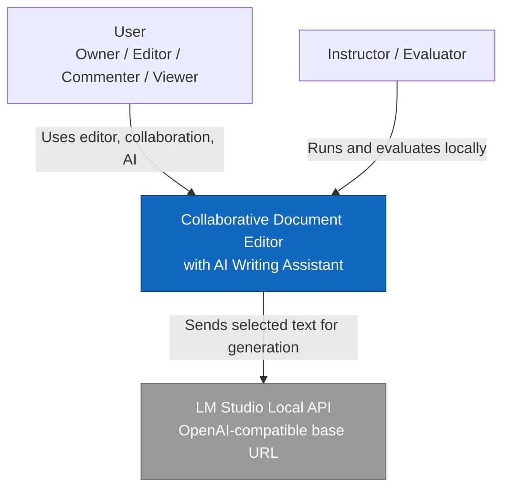
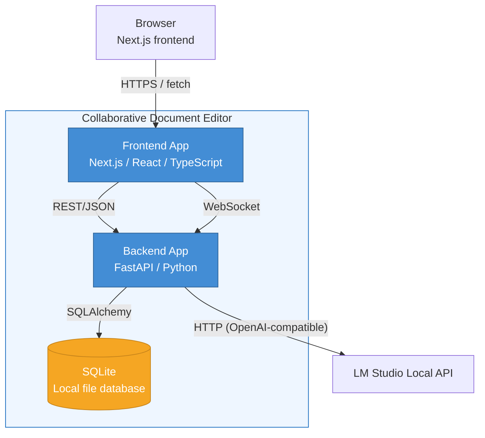
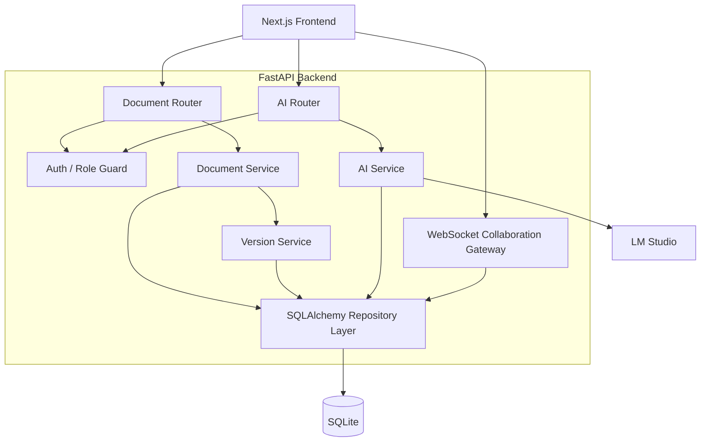
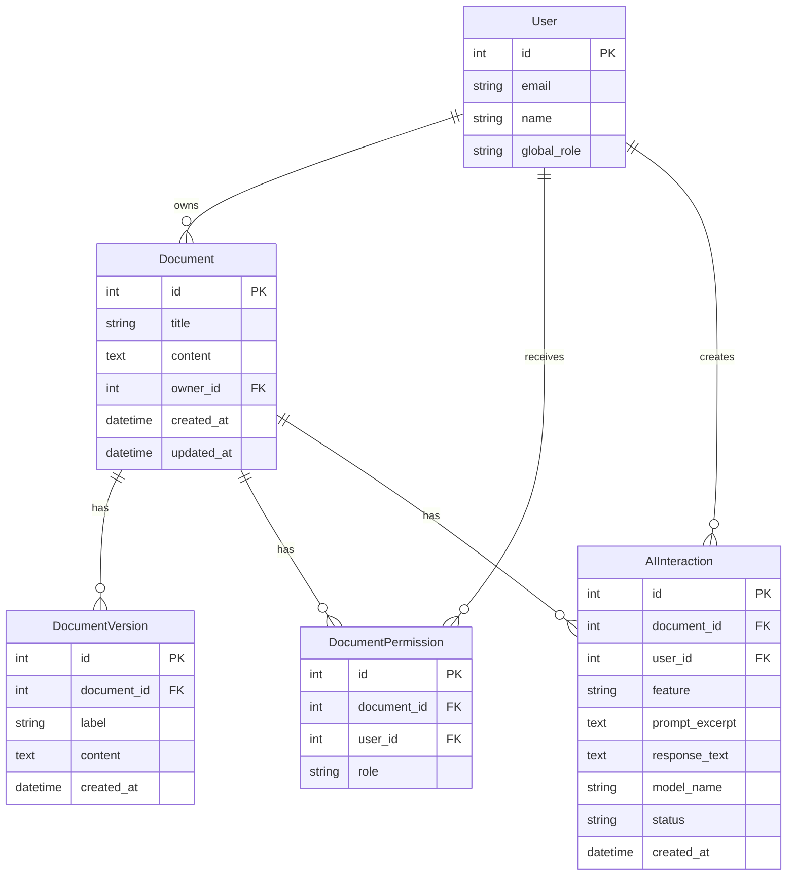
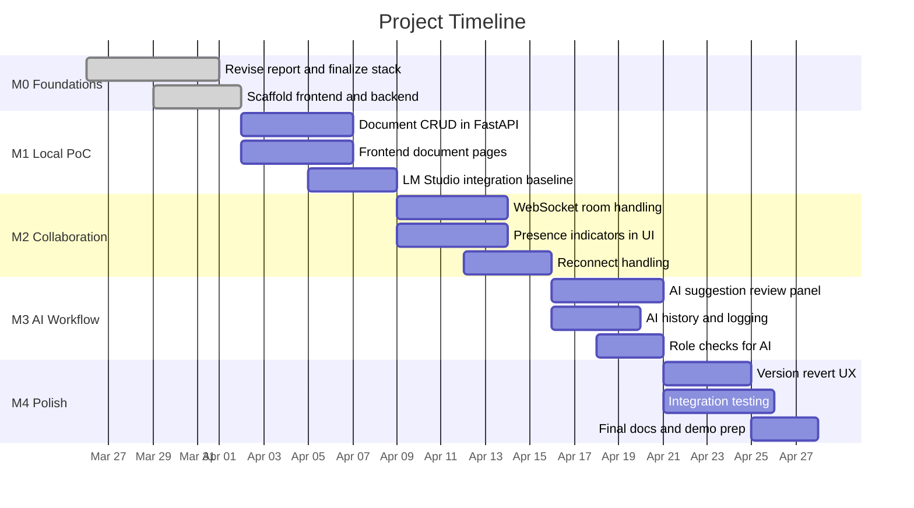

# Collaborative Document Editor with AI Writing Assistant

## Assignment 1: Requirements Engineering, Architecture & Proof of Concept

**Team Size:** 3 members  
**PoC Stack for This Submission:** Next.js frontend, FastAPI backend, local SQLite database, LM Studio local LLM API

---

# Part 1: Requirements Engineering (30%)

## 1.1 Stakeholder Analysis

| Stakeholder | Goals | Concerns | Influence on Requirements |
|---|---|---|---|
| **Document Owner / Primary Author** | Create, edit, share, and recover documents safely; use AI without losing control over the final text | Overwrites during collaboration; accidental acceptance of poor AI suggestions; unclear version history | Drives fine-grained roles, explicit accept/reject AI UX, and version history with revert support |
| **Collaborator / Editor** | Edit concurrently with others and see changes immediately | Lost work during conflicts or reconnects; AI changing text while they are editing nearby | Drives real-time sync, presence awareness, reconnection handling, and soft-lock behavior for AI operations |
| **Reviewer / Commenter** | Review content, leave feedback, and inspect how text evolved | Accidentally getting edit or AI powers; losing context after a rewrite | Drives distinct commenter permissions and visible AI/version history |
| **Instructor / Evaluator** | Run the proof of concept locally with minimal setup friction | Complex cloud dependencies, missing credentials, brittle install steps | Drives local-first architecture: SQLite, LM Studio, simple `.env` files, and one-command backend startup |
| **DevOps / Maintainer** | Keep the app understandable and easy to run on different machines | Too many moving parts, environment drift, and hidden runtime dependencies | Drives a simple monorepo layout, one FastAPI backend process, local SQLite persistence, and clear startup documentation |

---

## 1.2 Functional Requirements

### Real-Time Collaboration

| ID | Description | Trigger | Expected Behavior | Acceptance Criteria |
|---|---|---|---|---|
| FR-COLLAB-001 | The system shall propagate document updates to connected collaborators in near real time | A user edits a shared document | Other active editors receive the change over the collaboration channel | Two browser tabs editing the same document on localhost reflect updates within 150 ms (PoC target) |
| FR-COLLAB-002 | The system shall show collaborator presence in an active session | Two or more users are connected to the same document | Each user sees who else is online in the document session | Opening 3 clients on the same document shows 3 active participants in the session list |
| FR-COLLAB-003 | The system shall tolerate temporary disconnection and allow recovery on reconnect | A client loses network connectivity and later reconnects | The client reconnects to the session and resynchronizes the latest document state | After a forced disconnect, reconnecting restores the latest saved state without crashing the session |
| FR-COLLAB-004 | The system shall notify collaborators when a document is reverted to a saved version | Owner triggers a version revert | Active clients receive a visible notification and updated content | Reverting a version updates all connected clients within 3 seconds |

### AI Writing Assistant

| ID | Description | Trigger | Expected Behavior | Acceptance Criteria |
|---|---|---|---|---|
| FR-AI-001 | The system shall allow editors and owners to invoke AI actions on selected text | User selects text and chooses rewrite, summarize, translate, or restructure | The backend submits the request to LM Studio with the selected text and context | A valid request to `/api/ai/invoke` returns a generated suggestion with HTTP 200 |
| FR-AI-002 | The system shall present AI output as a suggestion rather than silently modifying the document | AI response is received | The suggestion is shown in a review area for user approval | The original document remains unchanged until the user explicitly accepts the suggestion |
| FR-AI-003 | The system shall log AI interactions for later review | An AI request completes | The request and response are stored in the local database | `/api/ai/history` returns the completed interaction with feature type and timestamp |
| FR-AI-004 | The system shall degrade gracefully if LM Studio is unavailable | An AI request is made while the local LLM server is offline | The system returns a clear error without affecting document editing | The API returns a 502-style failure response and the UI keeps editing enabled |
| FR-AI-005 | The system shall identify the document region currently being processed by AI | AI request starts on selected text | The frontend can mark the affected region as pending | The response payload includes enough context for the frontend to map the suggestion back to the selected region |

### Document Management

| ID | Description | Trigger | Expected Behavior | Acceptance Criteria |
|---|---|---|---|---|
| FR-DOC-001 | The system shall support document create, read, update, and delete operations | User performs a document action | The change is persisted locally in SQLite | CRUD operations on `/api/documents` succeed against the local database |
| FR-DOC-002 | The system shall support named document versions | User saves a version | A version snapshot is created and linked to the document | `/api/documents/{id}/versions` returns the saved version entry |
| FR-DOC-003 | The system shall allow reverting a document to a previous version | Owner chooses a version to restore | The document content is replaced by the selected version content | After revert, fetching the document returns the restored content |
| FR-DOC-004 | The system shall expose document metadata needed by the frontend | Frontend loads a document list or detail page | The API returns document id, title, content, and timestamps | Document responses contain id, title, content, `created_at`, and `updated_at` |

### User Management

| ID | Description | Trigger | Expected Behavior | Acceptance Criteria |
|---|---|---|---|---|
| FR-USER-001 | The proof of concept shall support local user identities for testing | Instructor or team member runs the app locally | The system can associate actions with a local test user identity | Demo accounts or seeded users can be used without any external identity provider |
| FR-USER-002 | The system shall enforce role-based access control at the API layer | A user attempts an action beyond their permission | The API rejects the action with a clear authorization error | A commenter attempting an AI invocation receives HTTP 403 |
| FR-USER-003 | The system shall distinguish owner, editor, commenter, and viewer roles | A document is shared or accessed | Allowed actions depend on the assigned role | A viewer can read but cannot update or invoke AI |
| FR-USER-004 | The system shall keep authorization rules simple enough for local testing | The app is set up on a new machine | No external auth service is required to test the PoC | The instructor can run the app with only local configuration files |

---

## 1.3 Non-Functional Requirements

### Latency

| ID | Requirement | Justification |
|---|---|---|
| NFR-LAT-001 | Keystroke propagation between two local collaborators shall be ≤ 150 ms end-to-end (P95) in the PoC | On a single local machine, the system should feel effectively real time |
| NFR-LAT-002 | The AI assistant shall acknowledge a request or begin rendering a loading state within 1 second | Users need immediate feedback that the local model request was accepted |
| NFR-LAT-003 | A document up to 1 MB shall load from SQLite and render in the UI within 2 seconds on a normal laptop | The local PoC should feel responsive without requiring tuned infrastructure |

### Scalability

| ID | Requirement | Justification |
|---|---|---|
| NFR-SCALE-001 | The architecture shall support at least 10 concurrent editors on a single document in the semester project target | This is sufficient for realistic team editing scenarios in the course context |
| NFR-SCALE-002 | The PoC shall support at least 50 active documents in the local database without schema changes | A local evaluator should be able to create enough sample data without performance collapse |
| NFR-SCALE-003 | The backend design shall allow future migration from SQLite to PostgreSQL without rewriting route handlers | This keeps the local-first PoC simple while preserving a path to a larger deployment later |

### Availability

| ID | Requirement | Justification |
|---|---|---|
| NFR-AVAIL-001 | Core document CRUD must remain usable even if the AI subsystem fails | Editing is the core product value; AI is an enhancement |
| NFR-AVAIL-002 | If the WebSocket collaboration channel disconnects, the user shall be informed within 3 seconds | Silent collaboration failure is confusing and risks duplicate or stale edits |
| NFR-AVAIL-003 | Local data shall persist across backend restarts through the SQLite database file | Instructors need to restart the app without losing demo data |

### Security & Privacy

| ID | Requirement | Justification |
|---|---|---|
| NFR-SEC-001 | For local development, only the selected text and small surrounding context shall be sent to LM Studio | Even though LM Studio runs locally, data minimization remains good practice |
| NFR-SEC-002 | Secrets and machine-specific paths shall be stored in `.env` files and excluded from version control | This keeps the repository portable and avoids accidental credential leaks |
| NFR-SEC-003 | The PoC shall avoid mandatory third-party cloud providers for authentication, storage, or AI inference | The assignment specifically benefits from a setup that works offline or on a single machine |

### Usability

| ID | Requirement | Justification |
|---|---|---|
| NFR-USE-001 | The UI shall clearly separate authored text from AI suggestions | Users must understand what is human-written and what is machine-suggested |
| NFR-USE-002 | The UI shall remain understandable when multiple collaborators are active by collapsing excess presence indicators | Presence is useful, but too many indicators create clutter |
| NFR-USE-003 | The core flows shall remain keyboard-accessible | Accessibility matters even in a student proof of concept |

---

## 1.4 User Stories and Scenarios

### Collaboration Scenarios

**US-01:** As an editor, I want my changes to appear quickly for another editor so that collaboration feels immediate.  
- Acceptance criteria: Two localhost browser windows editing the same document show updates within 150 ms in the PoC.

**US-02:** As an editor, I want to reconnect to an editing session after a connection drop so that I can continue without reopening the whole app.  
- Acceptance criteria: Reconnecting restores the latest server state and rejoins the presence list.

**US-03:** As a document owner, I want to revert to a saved version so that I can undo a bad change safely.  
- Acceptance criteria: Revert restores the saved content and creates a visible update for connected collaborators.

### AI Assistant Workflows

**US-04:** As an editor, I want to summarize a selected paragraph so that I can condense long content quickly.  
- Acceptance criteria: Sending selected text to the AI endpoint returns a summary suggestion that does not overwrite the document automatically.

**US-05:** As an editor, I want to translate a selected section so that I can prepare multilingual content.  
- Acceptance criteria: The AI response is returned in the requested target language.

**US-06:** As an editor, I want to partially apply an AI rewrite so that I stay in control of the final text.  
- Acceptance criteria: The suggestion is presented separately and the user can manually edit or selectively apply it in the frontend.

**US-07:** As a collaborator, I want to know when another user is running AI on a passage so that I avoid editing the same region at the same moment.  
- Acceptance criteria: The frontend can show a pending marker for the targeted region.

### Document Lifecycle

**US-08:** As an owner, I want to create and rename documents so that I can organize my work.  
- Acceptance criteria: The document list updates after create and rename actions.

**US-09:** As an owner, I want to browse saved versions of a document so that I can understand how it evolved over time.  
- Acceptance criteria: The version list includes labels and timestamps.

### Access Control and Roles

**US-10:** As a commenter, I want the system to explain why I cannot invoke AI so that the restriction feels intentional rather than broken.  
- Acceptance criteria: The user receives a clear permission message instead of a silent failure.

**US-11:** As a viewer, I want editing to be blocked gracefully so that I understand my current level of access.  
- Acceptance criteria: The editor enters read-only mode and shows a concise explanation.

**US-12:** As an instructor, I want to run the system without cloud signup steps so that testing the submission is quick and reproducible.  
- Acceptance criteria: Following the README with local `.env` files is sufficient to run the PoC.

---

## 1.5 Requirements Traceability Matrix

| User Story | Functional Requirements | Architecture Components |
|---|---|---|
| US-01 | FR-COLLAB-001, FR-COLLAB-002 | Next.js Frontend, FastAPI Collaboration Gateway |
| US-02 | FR-COLLAB-003 | FastAPI Collaboration Gateway, SQLite Document Store |
| US-03 | FR-COLLAB-004, FR-DOC-002, FR-DOC-003 | FastAPI Document Service, SQLite |
| US-04 | FR-AI-001, FR-AI-002, FR-AI-003 | Next.js Frontend, FastAPI AI Service, LM Studio Connector |
| US-05 | FR-AI-001, FR-AI-002 | FastAPI AI Service, LM Studio Connector |
| US-06 | FR-AI-002, FR-AI-005 | Next.js Frontend, FastAPI AI Service |
| US-07 | FR-AI-005, FR-COLLAB-002 | Next.js Frontend, FastAPI Collaboration Gateway |
| US-08 | FR-DOC-001, FR-DOC-004 | FastAPI Document Service, SQLite |
| US-09 | FR-DOC-002, FR-DOC-003 | FastAPI Document Service, SQLite |
| US-10 | FR-USER-002, FR-USER-003 | FastAPI Auth/Permission Layer, Next.js Frontend |
| US-11 | FR-USER-002, FR-USER-003 | FastAPI Auth/Permission Layer, Next.js Frontend |
| US-12 | FR-USER-004, NFR-SEC-003 | Submission README, FastAPI Backend, SQLite, LM Studio |

Every user story maps to at least one functional requirement. Every functional requirement maps to at least one architectural component in Part 2.

---

# Part 2: System Architecture (45%)

## 2.1 Architectural Drivers

Ranked by influence on the design:

1. **Low-friction local setup**  
   The instructor should be able to run the system on one machine with local services only. This directly drove the choice of SQLite, LM Studio, FastAPI, and a simple repo structure.

2. **Real-time collaboration quality**  
   The product promise is collaborative editing. This drove the decision to keep a WebSocket-based collaboration channel in the backend architecture.

3. **AI usefulness with acceptable latency**  
   AI must feel integrated, not bolted on. This drove selected-text prompts, explicit suggestion review, and direct LM Studio integration through a single backend service.

4. **Privacy and predictability**  
   Running the model locally reduces data exposure and avoids third-party API instability. This shaped the AI integration design and security assumptions.

5. **Team delivery speed**  
   A 3-person team needs clear boundaries. This drove the split between frontend, backend/data, and AI/integration responsibilities inside a single submission repository.

---

## 2.2 System Design Using the C4 Model

### Level 1 — System Context Diagram



**Explanation:** The system depends on only one external runtime component for the PoC: LM Studio running locally. No external database service, cloud storage, or third-party identity provider is required for evaluation.

---

### Level 2 — Container Diagram



**Container responsibilities:**

| Container | Responsibility | Technology |
|---|---|---|
| **Frontend App** | Document pages, editor shell, AI panel, presence UI, version UI, permission-aware interactions | Next.js, React, TypeScript |
| **Backend App** | REST API, WebSocket collaboration endpoint, document/version persistence, AI proxy to LM Studio, permission checks | FastAPI, SQLAlchemy, Python |
| **SQLite** | Local persistence for users, documents, versions, permissions, and AI history | SQLite |
| **LM Studio Local API** | Local LLM inference for rewrite, summarize, translate, and restructure features | LM Studio server |

---

### Level 3 — Component Diagram (FastAPI Backend)



**Component responsibilities:**

| Component | What It Does | Dependencies | Interface |
|---|---|---|---|
| Document Router | Handles CRUD and version endpoints | Auth Layer, Document Service | `/api/documents/*` |
| AI Router | Validates AI requests and returns suggestions/history | Auth Layer, AI Service | `/api/ai/*` |
| WebSocket Collaboration Gateway | Maintains live document sessions and broadcasts updates | Repository Layer | `/ws/documents/{documentId}` |
| Auth / Role Guard | Enforces owner/editor/commenter/viewer permissions | User/permission data | Middleware / dependencies |
| Document Service | Business rules for create, update, delete, list, and revert | Repository Layer | Internal |
| Version Service | Creates version snapshots and handles reverts | Repository Layer | Internal |
| AI Service | Builds prompts, calls LM Studio, logs AI interactions | LM Studio, Repository Layer | Internal |
| Repository Layer | Reads and writes SQLite data through SQLAlchemy | SQLite | Internal |

---

### Feature Decomposition

#### 1. Rich-Text Editor & Frontend State
- What it does: Hosts the editor UI, document pages, AI review panel, and presence indicators.
- Depends on: FastAPI REST endpoints and WebSocket collaboration endpoint.
- Interface: Fetch calls to `/api/*` and WebSocket sessions to `/ws/documents/{id}`.

#### 2. Real-Time Synchronization Layer
- What it does: Manages active document sessions and broadcasts updates to connected clients.
- Depends on: FastAPI WebSocket support and persisted document state in SQLite.
- Interface: WebSocket messages carrying document updates and presence events.

#### 3. AI Assistant Module
- What it does: Builds prompts from selected text, sends them to LM Studio, returns suggestions, and records history.
- Depends on: LM Studio local API and local persistence for interaction logs.
- Interface: `/api/ai/invoke` and `/api/ai/history`.

#### 4. Document Storage & Versioning
- What it does: Stores document content, metadata, and version snapshots.
- Depends on: SQLite through SQLAlchemy.
- Interface: `/api/documents`, `/api/documents/{id}`, `/api/documents/{id}/versions`.

#### 5. Authentication & Authorization
- What it does: Associates actions with local user identities and enforces per-role permissions.
- Depends on: User and permission tables.
- Interface: Route dependencies and future `/api/auth/*` endpoints.

#### 6. API Layer
- What it does: Exposes a stable contract between the Next.js frontend and the backend.
- Depends on: All backend services.
- Interface: REST endpoints and a WebSocket endpoint.

---

### AI Integration Design

#### Context and Scope
The AI service sends:
- the selected text,
- optionally a small surrounding context window,
- the requested feature type.

The full document is not sent by default. This keeps prompts focused, reduces local inference latency, and minimizes accidental data exposure even though the LLM is running locally.

#### Suggestion UX
The AI output is shown in a side panel or suggestion area rather than applied inline immediately.
- The original text stays unchanged until the user accepts it.
- The user can edit the suggestion before applying it.
- Partial application is handled in the frontend by letting the user copy or apply only part of the response.

#### AI During Collaboration
- The invoking user marks the selected region as “AI pending”.
- Other collaborators can still edit outside that region.
- If the region changes before the response is applied, the frontend should warn the user that the suggestion may now be stale.

This is a pragmatic compromise for the semester project: predictable and easy to explain, without trying to auto-merge AI edits into a moving target.

#### Prompt Design
Prompt construction is template-based in backend code.
- Each feature type maps to a specific instruction pattern.
- The prompt builder inserts selected text and surrounding context.
- Later iterations can move prompt templates into dedicated files without changing the route contract.

#### Model and Cost Strategy
Because LM Studio runs locally, the main constraint is not per-token billing but local compute capacity.
- The PoC uses a single configured local model.
- The backend can later route simple tasks to smaller local models and harder tasks to larger ones.
- If the model server is busy or unavailable, the backend returns a clear failure and leaves document editing unaffected.

---

### API Design

#### Document CRUD

| Method | Endpoint | Request Body | Response | Errors |
|---|---|---|---|---|
| GET | `/api/health` | — | `200 { status, app_name }` | — |
| GET | `/api/documents` | — | `200 [{ id, title, content, created_at, updated_at }]` | 500 |
| POST | `/api/documents` | `{ title, content, save_initial_version }` | `201 { id, title, content, created_at, updated_at }` | 400 |
| GET | `/api/documents/:id` | — | `200 { id, title, content, created_at, updated_at }` | 404 |
| PATCH | `/api/documents/:id` | `{ title?, content?, create_version?, version_label? }` | `200 { ...document }` | 404 |
| DELETE | `/api/documents/:id` | — | `204` | 404 |
| GET | `/api/documents/:id/versions` | — | `200 [{ id, document_id, label, content, created_at }]` | 404 |

#### Real-Time Session Management

| Protocol | Endpoint | Description |
|---|---|---|
| WebSocket | `/ws/documents/:id` | Broadcasts presence and update messages among clients connected to the same document |

Message examples:
- `{"type":"join","user":"alice@example.com"}`
- `{"type":"update","content":"...delta or document payload..." }`

#### AI Assistant

| Method | Endpoint | Request Body | Response | Errors |
|---|---|---|---|---|
| POST | `/api/ai/invoke` | `{ feature, selected_text, surrounding_context?, target_language?, document_id? }` | `200 { feature, output_text, model_name, provider, status }` | 404, 502 |
| GET | `/api/ai/history` | — | `200 [{ id, document_id, feature, prompt_excerpt, response_text, model_name, status, created_at }]` | 500 |

#### User & Permission Management

For the PoC, the authorization model is deliberately simple:
- local demo users,
- per-document roles,
- backend-enforced permission checks.

Suggested future endpoints:
- `POST /api/auth/login`
- `GET /api/users/me`
- `POST /api/documents/:id/permissions`

#### API Style Justification
- **REST** for CRUD and AI invocation because it is simple, testable, and well supported by FastAPI.
- **WebSocket** for collaboration because real-time push is necessary for editing sessions.
- A separate AI microservice is intentionally avoided in the PoC to keep setup friction low.

#### Long-Running AI Operations
In this PoC design, the frontend sends a regular HTTP request to `/api/ai/invoke` and shows a loading state until the local model returns. This is acceptable for the starter implementation because LM Studio runs on the same machine and the goal is a low-complexity local proof of concept.

If inference latency becomes a problem later, the same backend can be extended with:
- SSE for token streaming, or
- a job-based status endpoint.

#### Error Handling Strategy

Standard error shape:

```json
{
  "detail": "LM Studio request failed. Check the local server and model settings."
}
```

Client-visible interpretation:

| HTTP Status | Meaning | Client Action |
|---|---|---|
| 200 | Success | Show the suggestion |
| 403 | Permission denied | Explain the required role |
| 404 | Missing document | Redirect or show not found |
| 502 | LM Studio unavailable or invalid response | Keep editing enabled and show an AI-specific error |

---

### Authentication & Authorization

#### Why Authentication Is Needed
Documents and AI history belong to specific users and roles. Even in a local PoC, the system must differentiate between owner, editor, commenter, and viewer behavior.

#### Role Definitions

| Role | Read | Edit | Comment | Invoke AI | Revert Versions | Share |
|---|---|---|---|---|---|---|
| Owner | ✅ | ✅ | ✅ | ✅ | ✅ | ✅ |
| Editor | ✅ | ✅ | ✅ | ✅ | ❌ | ❌ |
| Commenter | ✅ | ❌ | ✅ | ❌ | ❌ | ❌ |
| Viewer | ✅ | ❌ | ❌ | ❌ | ❌ | ❌ |

Key choices:
- AI invocation is limited to editors and owners because it proposes content changes.
- Version revert is owner-only because it affects all collaborators.
- The PoC uses local identities instead of external OAuth to reduce setup friction.

#### Privacy Considerations
- The LLM runs locally through LM Studio, so document text does not need to leave the evaluator’s machine.
- Only the selected text and limited context are sent to the model.
- AI interaction history is stored in the same local database as the rest of the app data.

---

### Communication Model

#### Push-Based Collaboration
The system uses a push-based WebSocket model for collaboration.
- On document open, the frontend loads the current saved state through REST.
- It then opens a WebSocket connection for presence and live updates.
- If the socket disconnects, the UI shows a reconnecting indicator and attempts to reconnect.

#### Why Not Polling?
Polling is simpler but unsuitable for collaboration because:
- it adds avoidable latency,
- it wastes requests,
- it creates a worse user experience when two people are typing actively.

#### Open and Reconnect Flow
1. Frontend fetches the document from the REST API.
2. Frontend opens `ws://.../ws/documents/{id}`.
3. Backend registers the client in the document room.
4. Clients broadcast updates and presence changes.
5. On disconnect, the client reconnects and reloads the latest server state if needed.

---

## 2.3 Code Structure & Repository Organization

### Monorepo vs. Multi-Repo

**Decision: single submission repository with two app folders.**

This is not a complex workspace setup. The goal is clarity, not tooling sophistication. The current submission keeps the real application code inside `AI1220B-task-1/`, while the parent folder contains assignment artifacts such as `instructions.md`, `report.md`, and the team task split document.

### Directory Layout

```text
swe-task1/
├── instructions.md
├── report.md
├── team-task-division.md
├── meeting_log.md
└── AI1220B-task-1/
    ├── README.md
    ├── frontend/
    │   ├── app/
    │   ├── public/
    │   ├── package.json
    │   └── .env.example
    └── backend/
        ├── app/
        │   ├── main.py
        │   ├── config.py
        │   ├── database.py
        │   ├── models.py
        │   ├── schemas.py
        │   ├── services.py
        │   ├── realtime.py
        │   └── routers/
        │       ├── documents.py
        │       └── ai.py
        ├── tests/
        │   └── test_documents.py
        ├── data/
        ├── requirements.txt
        ├── .env.example
        └── README.md
```

### Shared Code
To keep the PoC simple, there is no separate shared package yet.
- The backend OpenAPI schema acts as the source of truth for the API contract.
- The frontend can either define lightweight matching TypeScript types or later generate them from FastAPI’s OpenAPI output.

This avoids premature repository complexity while still giving a clean upgrade path.

### Configuration Management
- Backend environment variables live in `AI1220B-task-1/backend/.env`.
- Frontend environment variables live in `AI1220B-task-1/frontend/.env.local`.
- The repository tracks only `.env.example` files.
- Important local settings: SQLite path, LM Studio base URL, LM Studio model name, frontend API base URL.

### Testing Structure
- **Backend unit tests:** route and service tests under `backend/tests/` in a later milestone.
- **Frontend component tests:** UI behavior tests near the corresponding components.
- **Integration tests:** backend with temporary SQLite database and mocked LM Studio.
- **End-to-end tests:** Next.js + FastAPI + local mock model or real LM Studio depending on the scenario.

For repeatable automated tests, the backend supports a mock AI mode instead of requiring the real local model every time.

---

## 2.4 Data Model

### Entity-Relationship Diagram



### Data Model Decisions

**Document representation**  
The PoC stores document content as text in SQLite. This keeps the starter template easy to inspect and debug. If the collaboration layer later adopts CRDT snapshots, the content field can evolve to structured JSON without breaking the high-level model.

**Versioning**  
Each version stores a content snapshot and optional label. Reverting does not delete history; it restores previous content through a new user action.

**AI interaction history**  
Each interaction stores:
- the related document,
- feature type,
- a prompt excerpt,
- the generated response,
- model name,
- status,
- timestamp.

This is enough for auditing and UI history panels later.

**Permissions and sharing**  
The model supports per-document roles. Link sharing and team-based sharing are future extensions, but the role structure already leaves room for them.

---

## 2.5 Architecture Decision Records (ADRs)

### ADR-001: Use Next.js for the Frontend and FastAPI for the Backend

| Field | Content |
|---|---|
| **Status** | Accepted |
| **Context** | The team needs a modern frontend and a backend that is fast to scaffold, easy to document, and convenient for local testing. |
| **Decision** | Use Next.js for the frontend and a single FastAPI backend for REST, WebSocket, and AI integration. |
| **Consequences** | Positive: fast setup, built-in API docs, simple Python backend structure, easy local development. Negative: fewer shared-language types than an all-TypeScript stack. |
| **Alternatives** | Node/Express was rejected for this submission because FastAPI offers quicker scaffolding and clearer local API documentation. |

### ADR-002: Use SQLite for the Proof of Concept Database

| Field | Content |
|---|---|
| **Status** | Accepted |
| **Context** | The instructor should be able to run the project locally without separately installing and configuring a database server. |
| **Decision** | Use a local SQLite file for the PoC. |
| **Consequences** | Positive: zero external DB setup, portable, easy to inspect. Negative: limited concurrency and weaker fit for production-scale collaboration. |
| **Alternatives** | PostgreSQL was considered, but rejected for the PoC because it adds avoidable setup friction. |

### ADR-003: Use LM Studio Through Its OpenAI-Compatible Local API

| Field | Content |
|---|---|
| **Status** | Accepted |
| **Context** | The user plans to use LM Studio and already has a base URL for it. The assignment also benefits from avoiding third-party cloud AI dependencies. |
| **Decision** | The backend calls LM Studio over its OpenAI-compatible HTTP API. |
| **Consequences** | Positive: local privacy, no external API key dependency for grading, stable local workflow. Negative: inference speed depends heavily on the evaluator’s hardware and chosen model. |
| **Alternatives** | Cloud-hosted LLM APIs were rejected for the PoC because they add credentials, billing, and network dependency. |

### ADR-004: Keep the PoC as a Simple Monorepo-Style Submission

| Field | Content |
|---|---|
| **Status** | Accepted |
| **Context** | A 3-person team needs a shared codebase with low coordination overhead. |
| **Decision** | Keep both apps in `AI1220B-task-1/` under `frontend/` and `backend/`, with assignment documents in the parent directory. |
| **Consequences** | Positive: easy to understand, easy to submit, fewer moving pieces. Negative: no dedicated shared package yet, so frontend/backend contracts must be kept aligned carefully. |
| **Alternatives** | Multi-repo and heavier workspace tooling were rejected because they add complexity without helping the PoC. |

---

# Part 3: Project Management & Team Collaboration (15%)

## 3.1 Team Structure & Ownership

### Role Assignments (3-person team)

| Member | Primary Ownership | Scope |
|---|---|---|
| **Member A** | Frontend & Editor UX | Next.js pages, editor shell, AI panel, presence UI, version history UI, API integration from the frontend |
| **Member B** | Backend & Data | FastAPI routes, SQLite schema, document/version logic, permission checks, API documentation |
| **Member C** | AI & Collaboration Integration | LM Studio integration, prompt design, AI history, WebSocket collaboration endpoint, local setup polish |

### Cross-Cutting Feature Handling
For features that touch all three areas:
1. Define the API contract first.
2. Build against a simple mock or stub.
3. Integrate in short vertical slices.

The most cross-cutting feature in this project is AI-assisted editing because it spans UI, backend logic, and local model integration.

### Decision-Making Process
- Decisions inside an ownership area are made by the owner.
- Cross-cutting changes are discussed briefly by the full team.
- Important choices are documented as short ADRs.

---

## 3.2 Development Workflow

### Branching Strategy
- Use short-lived feature branches.
- Merge to `main` only through pull requests.
- Keep branches small enough to review quickly.

Suggested naming:
- `frontend/editor-shell`
- `backend/document-crud`
- `ai/lm-studio-integration`

### Code Review
- Every PR requires at least 1 reviewer.
- PRs touching public API contracts should be reviewed by both frontend and backend owners.
- Review focus: correctness, clarity, and consistency with the report.

### Issue Tracking & Task Assignment
- Use a simple Kanban board: `Backlog`, `In Progress`, `Review`, `Done`.
- Split issues by vertical features and shared infrastructure.
- Tag issues with `frontend`, `backend`, `ai`, `collaboration`, `docs`, or `testing`.

### Communication
- Daily async updates in chat.
- One short weekly sync for planning and integration.
- Architectural decisions go into markdown, not only chat history.

---

## 3.3 Development Methodology

**Choice: lightweight sprint-based workflow.**

This team is small, so the process should stay minimal:
- 1-week planning horizon,
- async updates,
- short review/demo at the end of the week.

### Prioritization
- **Must have:** local startup, document CRUD, versioning, AI invocation, collaboration starter.
- **Should have:** role enforcement, polished AI review UI, stable reconnect behavior.
- **Could have:** tracked AI diffs, link sharing, export.

### Non-Visible Work
Local setup, test scaffolding, and README quality are explicitly planned tasks because they directly affect grading and reproducibility.

---

## 3.4 Risk Assessment

### Risk 1: LM Studio Performance Varies by Machine

| Aspect | Detail |
|---|---|
| **Description** | AI latency and quality depend on the evaluator’s local hardware and chosen model. |
| **Likelihood** | High |
| **Impact** | Medium |
| **Mitigation** | Keep prompts short, use selected text only, document recommended model settings, and support `LLM_MOCK=true` for testing. |
| **Contingency** | Demo the AI flow with a smaller local model or mock mode if hardware is limited. |

### Risk 2: Collaboration Logic Becomes More Complex Than the Starter Suggests

| Aspect | Detail |
|---|---|
| **Description** | A simple broadcast WebSocket template is not the same as full conflict-safe collaborative editing. |
| **Likelihood** | High |
| **Impact** | High |
| **Mitigation** | Treat the current WebSocket layer as a scaffold and plan a dedicated iteration for CRDT integration. |
| **Contingency** | Narrow the demo scope to basic shared-session updates if full conflict resolution is not ready. |

### Risk 3: Architecture and Code Drift Apart

| Aspect | Detail |
|---|---|
| **Description** | The report can become outdated if the implementation changes quickly. |
| **Likelihood** | Medium |
| **Impact** | High |
| **Mitigation** | Update the report whenever the team changes the stack, API contract, or repository structure. |
| **Contingency** | Reserve a final alignment pass before submission. |

### Risk 4: Local Environment Differences Cause Setup Failures

| Aspect | Detail |
|---|---|
| **Description** | Python version, Node version, or LM Studio configuration may differ between machines. |
| **Likelihood** | Medium |
| **Impact** | Medium |
| **Mitigation** | Keep startup commands simple, document required versions, and avoid unnecessary dependencies. |
| **Contingency** | Provide a short troubleshooting section in the submission README. |

### Risk 5: API Contract Mismatch Between Frontend and Backend

| Aspect | Detail |
|---|---|
| **Description** | The frontend may assume payload shapes that no longer match the backend. |
| **Likelihood** | Medium |
| **Impact** | Medium |
| **Mitigation** | Treat FastAPI’s OpenAPI schema as the contract source of truth and validate frontend integration against it regularly. |
| **Contingency** | Freeze the contract for the milestone and defer non-critical shape changes. |

---

## 3.5 Timeline and Milestones



### Milestone Acceptance Criteria

| Milestone | Target Date | Acceptance Criteria |
|---|---|---|
| **M0: Foundations** | 2026-04-01 | Report updated to match actual stack and repo layout. Backend and frontend starters exist. |
| **M1: Local PoC** | 2026-04-08 | Local startup works with SQLite and FastAPI CRUD. Frontend can talk to backend. LM Studio endpoint path is wired. |
| **M2: Collaboration** | 2026-04-15 | Two clients can join the same document room and receive live update events. |
| **M3: AI Workflow** | 2026-04-20 | Selected text can be sent to LM Studio through the backend and logged locally. |
| **M4: Polish** | 2026-04-28 | Version flow, basic role checks, integration tests, and demo instructions are in place. |
